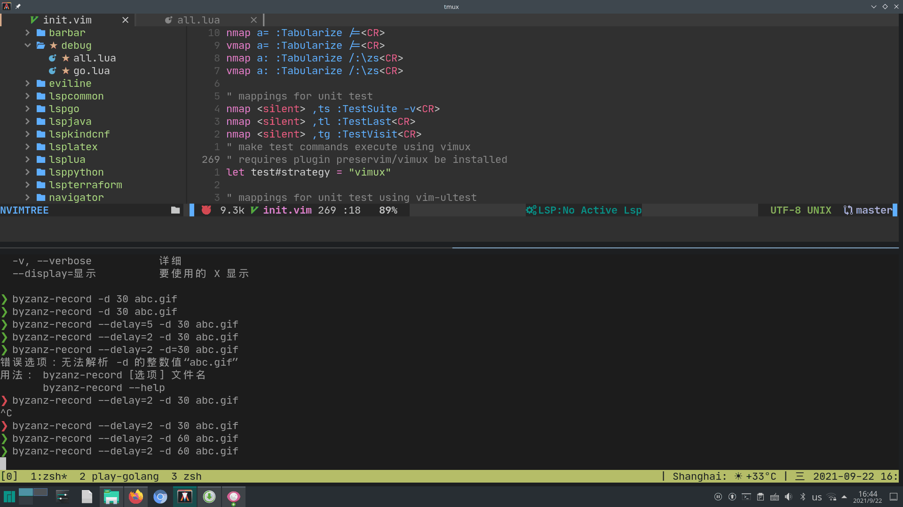

# 简介

dotneovim 是一种利用 git 管理 Neovim 配置及插件的方式。
本项目使用了纯 Lua 脚本配置 noevim，并借助 LSP，实现了可扩展的多语言开发环境。
以下为 golang 的开发环境示例：

本项目要求使用 neovim 0.5.0+， 添加或更新插件时需要执行：

    :source %
    :PackInstall

## MacOS X 及 Unix 安装方法

请使用以下命令将 dotvim 克隆到本地

    git clone https://github.com/schnell18/dotneovim ~/.neovim

然后请创建符号链接，指向 home 目录下的.vim/vimrc 文件：

    ln -s ~/.neovim ~/.config/nvim

## Python, golang, Rust Language Server 配置

为获得最佳使用效果，请安装以下命令工具：

- [ripgrep][2] -- 用于 telescope 插件的 live grep
- [gopls][4] -- golang language server
- [pyright][5] -- Python language server
- [rust\_analyzer][6] -- Rust language server
- [dlv][7] -- golang debugger
- [jq][8] -- Powerful JSON CLI processor

可使用 homebrew 安装 ripgrep, gh, rust\_analyzer :

    brew install ripgrep gh rust_analyzer

安装 gopls 请使用以下命令：

    GO111MODULE=on go get golang.org/x/tools/gopls@latest

如果有无法连接的问题，请尝试使用代理服务。

安装 pyright 请使用以命令：

    npm install -g pyright

## Plugin installed

本项目采用 [plug][1] 管理插件，以下是预装的插件清单：

- tpope/vim-sensible
- sainnhe/edge
- neovim/nvim-lspconfig
- williamboman/nvim-lsp-installer
- nvim-lua/completion-nvim
- SirVer/ultisnips
- honza/vim-snippets
- nvim-lua/popup.nvim
- nvim-lua/plenary.nvim
- nvim-telescope/telescope.nvim
- nvim-treesitter/nvim-treesitter
- nvim-treesitter/playground
- kyazdani42/nvim-web-devicons
- kyazdani42/nvim-tree.lua
- glepnir/galaxyline.nvim
- nvim-telescope/telescope-dap.nvim
- mfussenegger/nvim-dap
- rcarriga/nvim-dap-ui
- theHamsta/nvim-dap-virtual-text
- mfussenegger/nvim-dap-python
- pwntester/octo.nvim
- tpope/vim-commentary
- tpope/vim-repeat
- godlygeek/tabular
- hotoo/pangu.vim
- glepnir/dashboard-nvim
- folke/which-key.nvim
- romgrk/barbar.nvim
- folke/todo-comments.nvim
- folke/trouble.nvim
- ray-x/guihua.lua
- ray-x/navigator.lua
- onsails/lspkind-nvim
- hashivim/vim-terraform
- vim-test/vim-test
- rcarriga/vim-ultest
- preservim/vimux

[1]: https://github.com/junegunn/vim-plug
[2]: https://github.com/BurntSushi/ripgrep
[3]: https://github.com/cli/cli
[4]: https://github.com/golang/tools/blob/master/gopls/README.md
[5]: https://github.com/BurntSushi/ripgre://github.com/microsoft/pyright
[6]: https://github.com/rust-analyzer/rust-analyzer
[7]: https://github.com/go-delve/delve
[8]: https://stedolan.github.io/jq/
