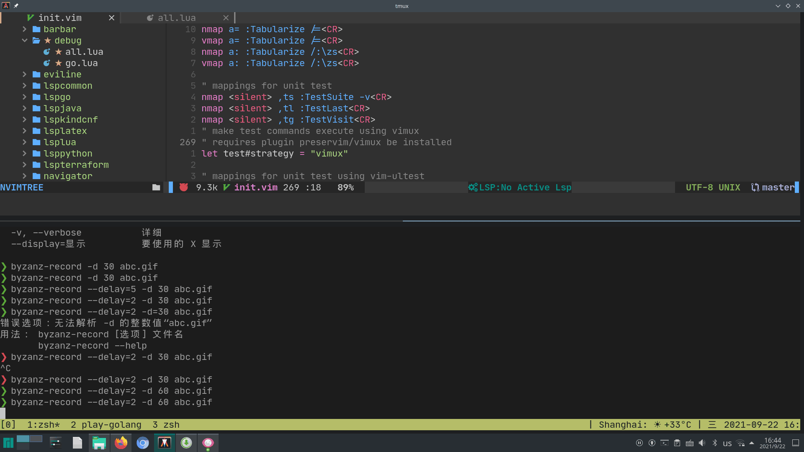

# Introduction

This project manages the neovim configuration based on [NVChard 2.5][1] in a
portable and extensible manner. It offers advanced authoring environment for
multiple programming languanges and structured document like Markdown, LaTeX.
The following screenshot is an demonstration of golang development environment.

## Pre-requisite

This project requires neovim 0.11.0 or above and supporting utilities as
follows:

- [ripgrep][2] -- for telescope's live grep feature
- [jq][4] -- Powerful JSON CLI processor
- [fd][5] -- Simpler and faster alternative to find

To install these tools, you may use the package manager of the OS or other
method you are familiar with. Here is an example for MacOS using homebrew:

    brew install ripgrep jq

## Installation on MacOS X or Unix

Clone the dotneovim project:

    git clone https://github.com/schnell18/dotneovim

Create symlink so that `~/.config/nvim` points to the directory of dotneovim you
just cloned:

    ln -s ~/dotneovim ~/.config/nvim

# Golang setup

The neovim ecosystem provides plenty of features to support convenient Golang
development in a character-based terminal environment. Major functionalities
include:

- Syntax highlighting (treesitter)
- LSP -- code completion, quick fix (gopls)
- Formatting (gofumpt, goimports-reviser, golines)
- Debugging (dap plugins)
- Unit test (neotest plugins)

These features enpower neovim to offer IDE-like coding experience while allowing
efficient editing.

## Reference

The following materials are useful for setting up a Golang development
environment based NvChad.

- [NvChad based Golang setup][6]
- [gopls settings reference][7]
- [Neovim Go(lang) Debug Setup][8]

[1]: https://github.com/NvChad/NvChad/tree/v2.5
[2]: https://github.com/BurntSushi/ripgrep
[4]: https://stedolan.github.io/jq/
[5]: https://github.com/sharkdp/fd#installation
[6]: https://github.com/ProgrammingRainbow/NvChad-2.5?tab=readme-ov-file#golang
[7]: https://github.com/golang/tools/blob/master/gopls/doc/settings.md
[8]: https://www.reddit.com/r/neovim/comments/1fi8qt7/neovim_golang_debug_setup/
